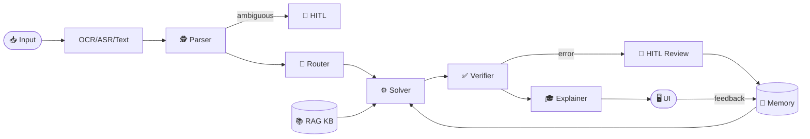

# 🧮 AI Math Mentor: Multimodal Agentic Solver

An end-to-end AI application designed to reliably solve JEE-style math problems, explain solutions step-by-step, and continuously improve over time. This project demonstrates advanced AI engineering patterns including **Retrieval-Augmented Generation (RAG)**, **Multi-Agent Orchestration**, **Human-in-the-Loop (HITL)** workflows, and **Self-Learning Memory**.

---

## 🌟 Key Features

- **Multimodal Inputs:** Accepts typed text, image uploads (via Tesseract OCR), and audio recordings (via Groq Whisper ASR).
- **Multi-Agent Architecture:** Utilizes a pipeline of 5 distinct LLM agents (Parser, Router, Solver, Verifier, Explainer) to break down and solve complex problems.
- **Retrieval-Augmented Generation (RAG):** Grounds the solver agent in a curated mathematical knowledge base using local HuggingFace embeddings and FAISS vector storage.
- **Human-in-the-Loop (HITL):** Automatically pauses execution and requests human intervention if OCR/ASR confidence is low, input is ambiguous, or the verifier agent detects a potential error.
- **Self-Learning Memory:** Stores human corrections and successful solution patterns in a vector database, allowing the system to reuse known patterns on similar future problems without model retraining.

---

## 🏗️ System Architecture



---

## 📁 File Structure

```
AI-Math-Mentor/
├── app.py                  # Main Streamlit UI & session state management
├── src/
│   ├── input_handler.py    # Multimodal parsing (OCR + Whisper ASR)
│   ├── agents.py           # 5-agent pipeline (Parser, Router, Solver, Verifier, Explainer)
│   ├── rag.py              # Knowledge base ingestion, chunking & FAISS embeddings
│   └── memory.py           # Self-learning memory layer (JSON log + FAISS store)
├── requirements.txt
└── .env                    # API keys (not committed to git)
```

| File | Description |
|------|-------------|
| `app.py` | The main Streamlit user interface. Handles user inputs, displays the agent trace, and manages session state. |
| `src/input_handler.py` | Manages multimodal parsing using `pytesseract` for image OCR and Groq's API for Whisper audio transcription. |
| `src/agents.py` | The core "brain" of the application. Contains Pydantic models and LangChain logic for the 5 agents. |
| `src/rag.py` | Handles ingestion, chunking, and embedding of the math knowledge base using HuggingFace and FAISS. |
| `src/memory.py` | Manages the self-learning memory layer, saving past interactions to a JSON log and a secondary FAISS database. |

---

## 🛠️ Tech Stack

| Layer | Technology |
|-------|-----------|
| Frontend | Streamlit |
| LLM Orchestration | LangChain, Groq API (`llama-3.3-70b-versatile`) |
| Embeddings & Vector Store | HuggingFace (`all-MiniLM-L6-v2`), FAISS |
| Multimodal Processing | Tesseract OCR, Groq Whisper |

---

## 🚀 Setup & Installation

### 1. Clone the repository

```bash
git clone https://github.com/yourusername/AI-Math-Mentor.git
cd AI-Math-Mentor
```

### 2. Set up a virtual environment

```bash
python -m venv venv
venv\Scripts\activate        # Windows
# source venv/bin/activate   # Mac/Linux
```

### 3. Install Python dependencies

```bash
pip install -r requirements.txt
```

### 4. Install Tesseract OCR

> Required for image input support.

- **Windows:** Download the 64-bit installer from [UB-Mannheim Tesseract OCR](https://github.com/UB-Mannheim/tesseract/wiki). By default, the app expects it at `C:\Program Files\Tesseract-OCR\tesseract.exe`.
- **Mac:** `brew install tesseract`
- **Linux:** `sudo apt-get install tesseract-ocr`

### 5. Configure API Keys

Create a `.env` file in the root directory:

```plaintext
GROQ_API_KEY=gsk_your_actual_api_key_here
```

> Get your free API key at [console.groq.com](https://console.groq.com)

### 6. Initialize the Knowledge Base

Build the local RAG vector database (run once before first launch):

```bash
python -m src.rag
```

### 7. Run the Application

```bash
streamlit run app.py
```

Navigate to **http://localhost:8501** in your browser.

---

---

## 📄 License

This project is licensed under the MIT License.
